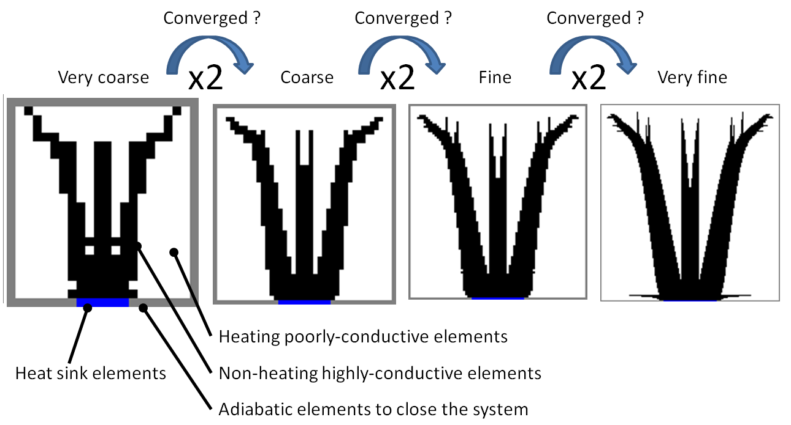
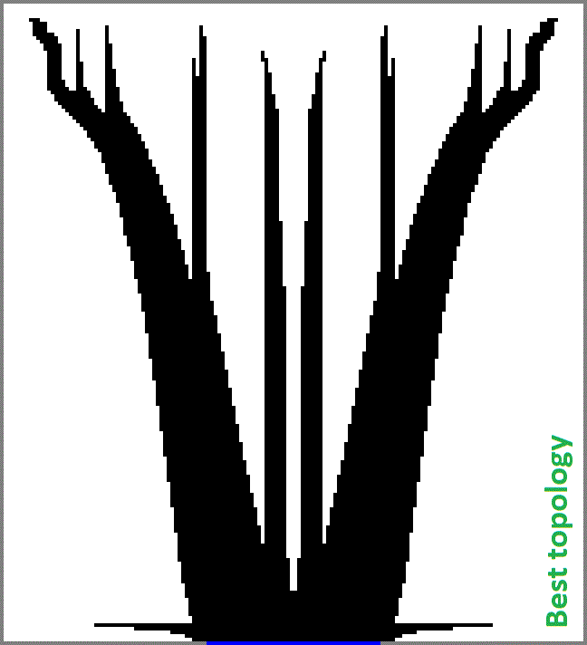
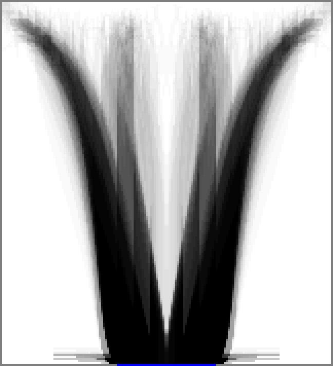
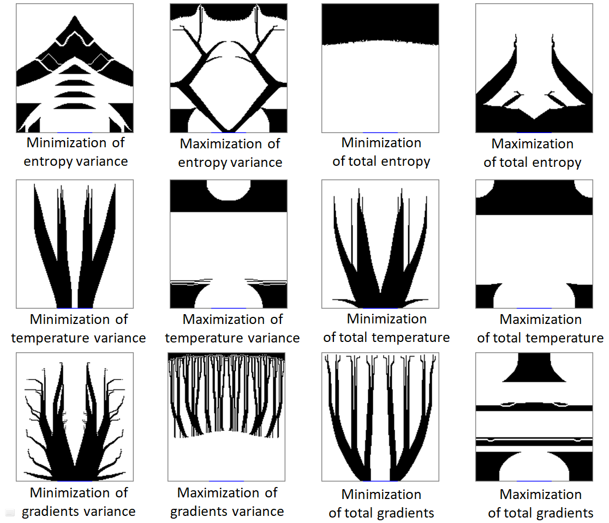

## Progressive Evolutionary Structural Optimisation (PESO) algorithm for thermal science

This is an improvement of the [ESO (Evolutionary Structural Optimisation)](https://github.com/Raphael-Boichot/Evolutionary-structural-optimisation-algorithm) to tackle the Area-to-point problem that was suggested in 2006 by [Lingai Luo](https://scholar.google.fr/citations?user=2Q79jugAAAAJ&hl=fr), my post-doctoral supervisor, so quite long ago, but never implemented to my knowledge. The idea is to use very coarse geometry first and to rescale progressively the domain meshing, in order to fasten the convergence. The principle works great but has the flaw of its main advantage: going fast increases the probability to fall into a local optimum. But damn, this is fast !

## General strategy: doubling the scale of domain after convergence of an ESO algorithm at a given scale

It can be observed that as boundary condition elements are also doubled in the rescaling operation, the redounding external layer is discarded at each doubling step, this why the overall number of elements along one dimension is not strictly doubling at each step. Practically, after 3 steps of rescaling (8x in total), the calculations become impractically slow for a gain in thermal resistance below the standard deviation between runs. This means that it is more intersting to run a batch and take the best candidate topology than refining more a given topology. Sidenote: the optimization is scale independant regarding thermal properties so there is no bias when rescaling.

Overall this code converges much faster than the "regular" ESO algorithm (Globally 50x faster) but the topology obtained are a bit more coarse and less fibrous (mathematically, non branched/fibrous shapes are optimal). This implies that they are a bit less efficient but also easier to fabricate. The shapes at convergence are very similar to the [Genetic Algorithm implementation](https://github.com/Raphael-Boichot/A-genetic-algorithm-for-topology-optimization-of-area-to-point-heat-conduction-problem).

**Some cheats are used to fasten and ease convergence:**
- The code starts by assessing 20 random topologies with 20 ESO steps (Monte Carlo stage). This allows avoiding to fall into obvious local minima as the "coarse" epochs kind of determine what the final shape will be, even if thermal resistance between converged shapes are very similar;
- The best topology is always kept in memory as the ESO algorithm does not always improves topology near the global optimum for a given mesh. At the mesh doubling step, the last best known geometry is recalled for faster convergence. So topology can "jitter" at this step, this is intended;
- The maximal number of etch/growth allowed for one cell are progressively increased with mesh refining;
- The redunding boundary cells around the adiabatic/isothermal external borders are discarded at each mesh doubling in order to avoid superfluous calculations;
- Of course only half a domain is considered for calculation. The whole topology is reconstructed by mirroring;

**The method has obvious flaws:**
- The ESO algorithm tends to focus mainly on the base of the "tree" whatever the hyper parameters I use. Not sure how to fix that without introducing bias. It may just be due to the poor sensitivity of thermal resistance to the conductivity of "terminal" cells;
- Starting from a coarse mesh and refining it leads to more compact shapes at the end. The code falls easily into some local minima.

Despite its flaws, the code generates topologies with very similar thermal properties: on a run of 49 converged case (shown below), the thermal resistance standard value falls below 0.6% ! This means, seing the diversity of shapes having similar properties, that the objective function is very flat near the global optimum. Values of thermal resistances are very close to the best cases presented in [this paper, figure 8, black arrow](https://github.com/Raphael-Boichot/A-genetic-algorithm-for-topology-optimization-of-area-to-point-heat-conduction-problem/blob/main/2016-IJTS-BOICHOT.pdf).

## Exemple of 49 converged cases with kp/k0=10 and filling ratio = 0.3, from best to worst, max temperature minimization

## Exemple of 49 converged cases with kp/k0=10 and filling ratio = 0.3, averaged, max temperature minimization

## Exemple of various objective functions tackled with the code (kp/k0=10 and filling ratio = 0.3), shapes that better fits with a bad trip than a research paper.

Despite the fascinating aspect of these optimized shapes, it appears clearly that the entropy equipartition is not a relevant principle to optimize this problem. It works relatively well for linear heat exchangers but is completely aberrant for topology optimization in more than 1D.

## Exemple of convergence steps with kp/k0=10 and filling ratio = 0.3, domain size from 1x to 8x (10 steps per frame), max temperature minimization

## Conclusion

This is by far the fastest and most efficient algorithm I've written to tackle this problem. It will stay unpublished for the moment because I don't care having more papers in thermal science, it will not change anything in my career. I can also foresee the hassle of publishing this: finite difference not efficient, why not finite elements, why not a gradient method, why not a phase field formulation, why not Comsol, why not a staggered grid, etc. I'm honestly bored with all of that. I think I'm more interested in the aesthetic of this branches now than in any real industrial application. I see them as pure mathematical amusement and art.

Anyway, if you enjoy the code and use it, cite the author !
